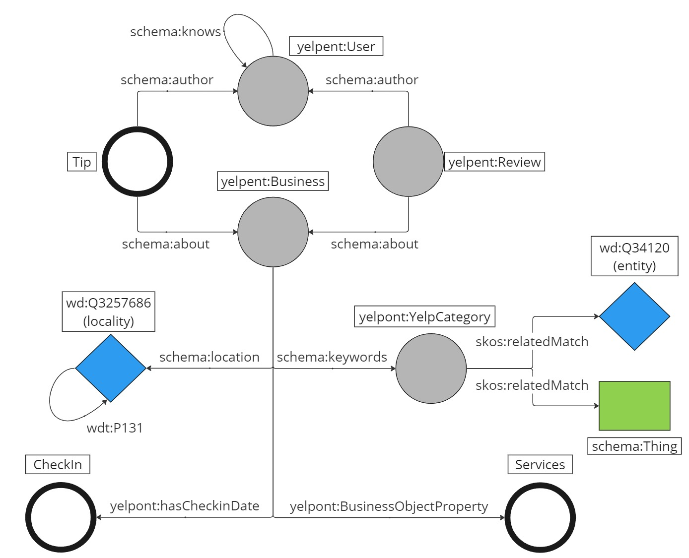

# The Yelp Collaborative Knowledge Graph
This is the GitHub repository associated with the paper "The Yelp Collaborative Knowledge Graph". In here, we present the abstract of the paper and provide details on the knowledge graph structure and namespaces, as well on how to obtain the knowledge graph.

## Abstract

COPY IN

## Knowledge Graph Structure
In the figure below, the structure of the YCKG is showcased. 



For a complete view of the YCKG will all entities and predicates, we refer to the figure found [here](/Code/Illustrations/KG_structure_diagram.jpg). 

### Namespaces
For creating the YCKG, the following namespaces were created:
```ttl
@prefix yelpcat: <https://purl.archive.org/purl/yelp/business_categories#> .
@prefix yelpont: <https://purl.archive.org/purl/yelp/yelp_ontology#> .
@prefix yelpent: <https://purl.archive.org/purl/yelp/yelp_entities#> .
```
Furthermore, the following existing namespaces were also utilised:
```ttl
@prefix schema: <https://schema.org/> .
@prefix skos: <http://www.w3.org/2004/02/skos/core#> .
@prefix rdfs: <http://www.w3.org/2000/01/rdf-schema#> .
@prefix xsd: <http://www.w3.org/2001/XMLSchema#> .
@prefix wiki: <https://www.wikidata.org/entity/> .
@prefix wiki_prop: <https://www.wikidata.org/wiki/Property:> .
```

## Knowledge Graph Generation
This section is split into two ways to get the YCKG. You can either [download the KG from Zenodo](#zenodo), or [run the source code on your own machine](#directly-from-source). Furthermore, three versions of the KG are available, depending on preference. (1) a "clean" version of the KG that contains none of the mappings to Schema or Wikidata; (2) a version that contains the mappings to Schema, but not to Wikidata; (3) a version that contains both the mappings to Schema and to Wikidata.

### Requirements
:::TODO:::

### Zenodo
:::TODO:::

[https://zenodo.org/](https://zenodo.org/)

### Directly from Source
To run the code yourself and obtain the YCKG, follow the following steps:
1. Download the [Yelp Open Dataset](https://www.yelp.com/dataset) and put it into a folder of your choice
2. Download the data from the Github folder [UtilityData]() and also put it into the same folder as YOD.
3. In the terminal run 

```bash
python3.10 create_YCKG.py --read_dir 'path/to/data' --write_dir 'path/to/destination' --include_schema True --include_wikidata True
```

The arguments specify the following:
- ```--read_dir```: The directory in which the data from points 1 and 2 is stored.
- ```--write_dir```: The directory in which the .nt files should be stored.
- ```--include_schema```: If True also creates the .nt files to link YCKG to Schema.
- ```--include_wikidata```: If True also creates the .nt files to link YCKG and Schema to Wikidata.


